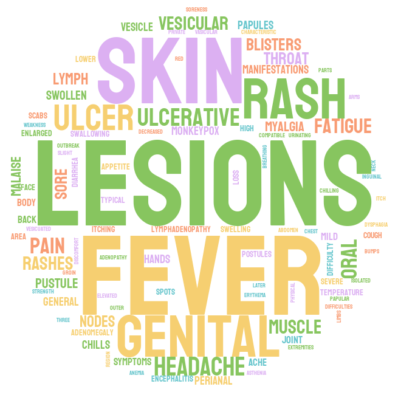

# Monkeypox data analysis
 Monkeypox viral disease that can be spread between people or between people and certain animals, which has become a serious global pandemic since early 2022. 
This [Monkeypox data](https://github.com/globaldothealth/monkeypox) is gathered by Global Health team in a 100-day mission to provide decision makers, researchers, and the public with timely and accurate, openly-accessible, global line-list data for the 2022 monkeypox outbreak (Final update on 22/09/2022). Our target is to use this dataset to provide a clear report of the transmission of Monkeypox. 

## Visualizations
We also plot a word cloud that shows the most mentioned synptoms among patients.

