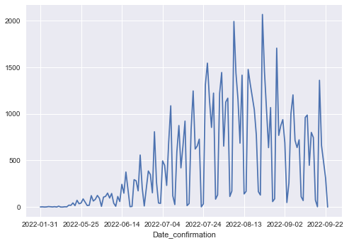

# Monkeypox data analysis
Monkeypox is a viral disease that can be spread between people or between people and certain animals, which has become a serious global pandemic since early 2022. 
This [Monkeypox dataset](https://github.com/globaldothealth/monkeypox) is gathered by Global Health team in a 100-day mission to provide decision makers, researchers, and the public with timely and accurate, openly-accessible, global line-list data for the 2022 monkeypox outbreak (Final update on 22/09/2022). Our target is to use this dataset to provide a clear report of the transmission of Monkeypox. 

## Data clean/analysis
This dataset has been well-organised and almost does not require preprocessing. All the data analysis are performed in Python 3.7 (`pandas`, `matplotlib`, `seaborn`). 

## Results and Visualizations
I firstly plot the trend of the spread of disease. It is very clear that Monkeypox started to spread around April, and the number of daily confirmed reached the peak around August to September, and then it tend to decrease.

To see the country with the most cases, we can also use a bar plot to show the top 10 countries with the most cases so far after the outbreak of Monkypox.

Here I also give an overview of transmission from a global heatmap, which shows the total number of confirmed cases in each counrtry.

<noscript></noscript><object class='tableauViz'  style='display:none;'><param name='host_url' value='https%3A%2F%2Fpublic.tableau.com%2F' /> <param name='embed_code_version' value='3' /> <param name='site_root' value='' /><param name='name' value='Monkeypoxglobalconfirmations&#47;Globalheatmapoftotalcases' /><param name='tabs' value='no' /><param name='toolbar' value='yes' /><param name='static_image' value='https:&#47;&#47;public.tableau.com&#47;static&#47;images&#47;Mo&#47;Monkeypoxglobalconfirmations&#47;Globalheatmapoftotalcases&#47;1.png' /> <param name='animate_transition' value='yes' /><param name='display_static_image' value='yes' /><param name='display_spinner' value='yes' /><param name='display_overlay' value='yes' /><param name='display_count' value='yes' /><param name='language' value='en-GB' /><param name='filter' value='publish=yes' /></object>
               

Finally, I also plot a word cloud that shows the most common synptoms among patients.

